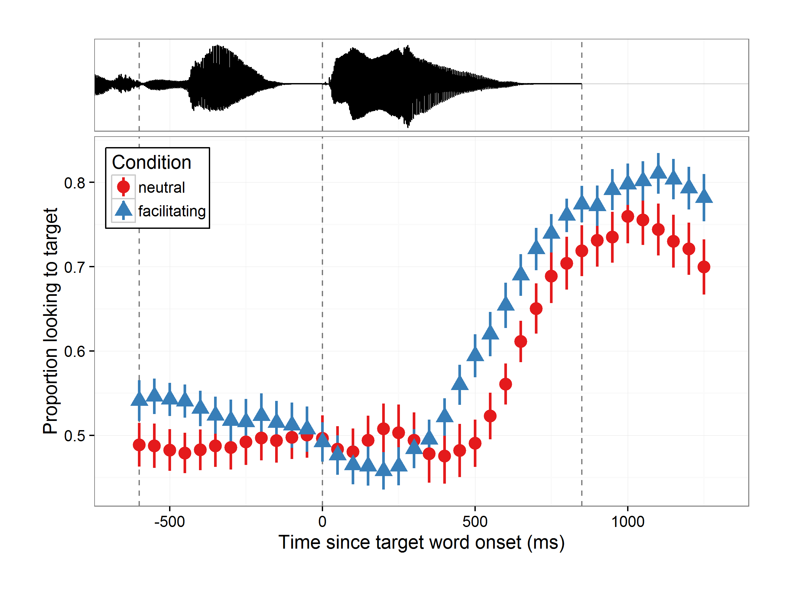

This is a one-off script I wrote to make a figure for a talk. It shows the alignment of looking behavior to the acoustic signal.

``` r
# Make figures
library("ggplot2")
library("readr")
library("dplyr", warn.conflicts = FALSE)
library("audio")
library("grid")
library("gridExtra")
inv_logit <- gtools::inv.logit

## ggplot2 shortcuts
my_theme <- theme_bw(base_size = 14)

# minimize distance between upper and lower plot
top_margin <- theme(plot.margin = unit(c(10, 10, 0, 10), "mm"))
bot_margin <- theme(plot.margin = unit(c(0, 10, 10, 10), "mm"))
full_margin <- theme(plot.margin = unit(c(10, 10, 10, 10), "mm"))

# x axis limits and landmarks
set_xlims <- coord_cartesian(xlim = c(-650, 1300))
landmarks <- geom_vline(xintercept = c(-600, 0, 850), linetype = "dashed", 
                        alpha = .5)

## waveform shortcuts

# no x axis
vanish_x_axis <- theme(
  axis.title.x = element_blank(),
  axis.text.x = element_blank(),
  axis.ticks.x = element_blank())

vanish_y_minor <- theme(panel.grid.minor.y = element_blank())

# Use invisible text/tick so padding/margin is preserved
vanish_y_label <- theme(
  axis.text.y = element_text(color = "white"),
  axis.ticks.y = element_line(color = "white"))

## gazeplot shortcuts
inset_legend <- theme(
  legend.position = c(0, 1),
  legend.justification = c(0, 1),
  legend.background = element_rect(fill = "white", color = "black"))
gaze_labs <- labs(x = "Time since target word onset (ms)",
                  y = "Proportion looking to target")

# Full looking data
looks_full <- read_csv("data/binned_looks.csv") %>% # as.tbl %>%
  select(-ToDistractor, -ToTarget) %>%
  filter(Condition != "filler", -600 <= Time, Time < 1300) %>%
  mutate(Condition = factor(Condition, levels = c("neutral", "facilitating")))

# Process audio
wave <- load.wave("stimuli/wavs/Whe_hi_the_V_Ball_neut.wav") %>% unclass

# Get duration from sampling rate
rate <- attr(wave, "rate")
ms_length <- (length(wave) / rate) * 1000
ms_rate <- seq(from = 0, to = ms_length, length.out = length(wave))


# Add times, aligned so that 0ms is target onset
target_onset <- ms_length - 850
df_wave <- data_frame(ms = ms_rate - target_onset, amp = as.numeric(wave)) 

# draw waveform
p_wave <- ggplot(df_wave) +
  aes(x = ms, y = amp) +
  landmarks + set_xlims +
  geom_hline(yintercept = 0, alpha = .1) + 
  geom_line() +
  # empty label + tick "0.0" so axis lines up with 0.X values in lower plot
  scale_y_continuous(" ", breaks = 0, labels = "0.0") +
  my_theme + vanish_x_axis + vanish_y_minor + vanish_y_label + top_margin
p_wave
```

<!-- -->

``` r
p_looks <- ggplot(looks_full) +
  aes(x = Time, y = Proportion, color = Condition, shape = Condition) +
  landmarks + set_xlims +
  stat_summary(fun.y = "mean", geom = "point", size = 3.5) +
  stat_summary(fun.data = "mean_se", geom = "pointrange", size = 1) +
  my_theme +  inset_legend  + bot_margin + gaze_labs + 
  scale_color_brewer(palette = "Set1") 
p_looks
```

<!-- -->

``` r
p_both <- arrangeGrob(p_wave, p_looks, ncol = 1, nrow = 2,
                      widths = c(4), heights = c(1.5, 5))
grid.arrange(p_both)
```

<!-- -->

``` r
ggsave("extras/marg-wave_large.png", plot = p_both, width = 8, height = 6)
```


