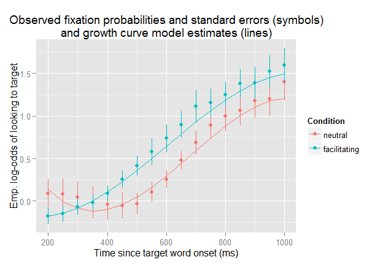

# Models

_This script generates the summary tables and reports statistics for the 
models in the article._


## Model Output

`lme4::summary` of the final model:


```
## Linear mixed model fit by maximum likelihood  ['lmerMod']
## Formula: 
## elogit ~ ot1 + ot2 + ot3 + (ot1 + ot2 + ot3 | Subj) + Condition +  
##     (ot1 + ot2 + ot3 | Subj:Condition) + ot1:Condition + ot2:Condition +  
##     ot3:Condition
##    Data: looks
## Weights: 1/elogit_wt
## 
##      AIC      BIC   logLik deviance df.resid 
##    561.5    703.5   -251.8    503.5      957 
## 
## Scaled residuals: 
##     Min      1Q  Median      3Q     Max 
## -2.6217 -0.4715  0.0212  0.5708  3.7655 
## 
## Random effects:
##  Groups         Name        Variance Std.Dev. Corr             
##  Subj:Condition (Intercept) 0.15052  0.3880                    
##                 ot1         1.96190  1.4007   -0.10            
##                 ot2         0.40998  0.6403   -0.08  0.33      
##                 ot3         0.23304  0.4827    0.18 -0.33  0.09
##  Subj           (Intercept) 0.08938  0.2990                    
##                 ot1         0.94671  0.9730    0.69            
##                 ot2         0.01087  0.1043    0.40 -0.38      
##                 ot3         0.05626  0.2372   -0.57 -0.99  0.52
##  Residual                   0.33249  0.5766                    
## Number of obs: 986, groups:  Subj:Condition, 58; Subj, 29
## 
## Fixed effects:
##                           Estimate Std. Error t value
## (Intercept)                0.43812    0.09156   4.785
## ot1                        1.84077    0.32006   5.751
## ot2                        0.52126    0.12795   4.074
## ot3                       -0.43315    0.10807  -4.008
## Conditionfacilitating      0.21110    0.10299   2.050
## ot1:Conditionfacilitating  0.53737    0.37370   1.438
## ot2:Conditionfacilitating -0.50337    0.17921  -2.809
## ot3:Conditionfacilitating  0.19631    0.13970   1.405
## 
## Correlation of Fixed Effects:
##             (Intr) ot1    ot2    ot3    Cndtnf ot1:Cn ot2:Cn
## ot1          0.175                                          
## ot2         -0.013  0.223                                   
## ot3         -0.021 -0.447  0.117                            
## Cndtnfclttn -0.562  0.056  0.044 -0.107                     
## ot1:Cndtnfc  0.054 -0.584 -0.219  0.188 -0.094              
## ot2:Cndtnfc  0.035 -0.183 -0.698 -0.061 -0.064  0.316       
## ot3:Cndtnfc -0.093  0.170 -0.066 -0.645  0.165 -0.291  0.099
```

 


## Write up


The log-odds of looking to target in the neutral condition over the entire 
analysis window were estimated by the intercept term, 
_&gamma;_<sub>00</sub>&nbsp;=&nbsp;0.44 
(proportion:&nbsp;.61). The linear, quadratic, and cubic orthogonal 
time terms were all significant, confirming a curvilinear, sigmoid-shape change 
in looks to target over time.

There was a significant increase in accuracy in the facilitating condition 
[<em>&gamma;</em><sub>01</sub>&nbsp;=&nbsp;0.21; SE&nbsp;=&nbsp;0.10; _t_&nbsp;=&nbsp;2.05; _p_&nbsp;=&nbsp;.04] such that the overall proportion of looking to target 
increased by .05. There was a significant effect of condition on 
the quadratic term [<em>&gamma;</em><sub>21</sub>&nbsp;=&nbsp;&minus;0.50; SE&nbsp;=&nbsp;0.18; _t_&nbsp;=&nbsp;&minus;2.81; _p_&nbsp;=&nbsp;.005]. These effects can be 
interpreted geometrically: The larger intercept increases the overall area 
under the curve, and the reduced quadratic effect decreases the bowing on the 
center of the curve, allowing the facilitating curve to obtain its positive 
slope earlier than the neutral curve. There was not a significant effect of 
condition on the linear term [<em>&gamma;</em><sub>11</sub>&nbsp;=&nbsp;0.54; SE&nbsp;=&nbsp;0.37; _t_&nbsp;=&nbsp;1.44; _p_&nbsp;=&nbsp;.15], indicating that the 
overall slopes of the growth curves did not differ significantly. These 
condition effects result in the two curves being roughly parallel at the 
center of the analysis window but with points phase-shifted by 100 ms. 


## Tables

### Fixed effects


Table: Model fixed effects

Parameter                                                                 Estimate      SE            _t_      _p_
-------------------------------------------------------------------  -------------  ------  -------------  -------
Intercept (<em>&gamma;</em><sub>00</sub>)                                    0.438   0.092          4.785   < .001
Time (<em>&gamma;</em><sub>10</sub>)                                         1.841   0.320          5.751   < .001
Time^2^ (<em>&gamma;</em><sub>20</sub>)                                      0.521   0.128          4.074   < .001
Time^3^ (<em>&gamma;</em><sub>30</sub>)                               &minus;0.433   0.108   &minus;4.008   < .001
Facilitating Cond. (<em>&gamma;</em><sub>01</sub>)                           0.211   0.103          2.050     .040
Time &times; Facilitating Cond. (<em>&gamma;</em><sub>11</sub>)              0.537   0.374          1.438     .150
Time^2^ &times; Facilitating Cond. (<em>&gamma;</em><sub>21</sub>)    &minus;0.503   0.179   &minus;2.809     .005
Time^3^ &times; Facilitating Cond. (<em>&gamma;</em><sub>31</sub>)           0.196   0.140          1.405     .160

### Random effects


Table: Model random effects

Group                     Parameter                                        Variance      SD   Correlations       &nbsp;    &nbsp;     &nbsp;
------------------------  ----------------------------------------------  ---------  ------  -------------  -----------  --------  ---------
Child                     Intercept (<em>U</em><sub>0<em>j</em></sub>)        0.089   0.299           1.00                                  
                          Time (<em>U</em><sub>1<em>j</em></sub>)             0.947   0.973            .69         1.00                     
                          Time^2^ (<em>U</em><sub>2<em>j</em></sub>)          0.011   0.104            .40   &minus;.38      1.00           
                          Time^3^ (<em>U</em><sub>3<em>j</em></sub>)          0.056   0.237     &minus;.57   &minus;.99       .52       1.00
Child &times; Condition   Intercept (<em>W</em><sub>0<em>jk</em></sub>)       0.151   0.388           1.00                                  
                          Time (<em>W</em><sub>1<em>jk</em></sub>)            1.962   1.401     &minus;.10         1.00                     
                          Time^2^ (<em>W</em><sub>2<em>jk</em></sub>)         0.410   0.640     &minus;.08          .33      1.00           
                          Time^3^ (<em>W</em><sub>3<em>jk</em></sub>)         0.233   0.483            .18   &minus;.33       .09       1.00
Residual                  <em>R</em><sub><em>tjk</em></sub>                   0.332   0.577                                                 


## Model Comparisons

The effects are age and vocabulary are tested by using nested model comparisons 
via the `anova` function. 


### Age Models


Table: Age models

          Df      AIC      BIC    logLik   deviance   Chisq   Chi Df   Pr(>Chisq)
-------  ---  -------  -------  --------  ---------  ------  -------  -----------
MODEL1    29   561.55   703.46   -251.77     503.55      NA       NA           NA
MODEL2    30   560.91   707.72   -250.45     500.91    2.64        1         0.10
MODEL3    31   562.76   714.47   -250.38     500.76    0.14        1         0.71
MODEL4    32   564.74   721.33   -250.37     500.74    0.03        1         0.87
MODEL5    33   566.45   727.94   -250.23     500.45    0.29        1         0.59


Table: Age x Condition models

          Df      AIC      BIC    logLik   deviance   Chisq   Chi Df   Pr(>Chisq)
-------  ---  -------  -------  --------  ---------  ------  -------  -----------
MODEL1    29   561.55   703.46   -251.77     503.55      NA       NA           NA
MODEL2    31   562.84   714.55   -250.42     500.84    2.70        2         0.26
MODEL3    33   566.30   727.79   -250.15     500.30    0.54        2         0.76
MODEL4    35   567.02   738.30   -248.51     497.02    3.28        2         0.19
MODEL5    37   570.66   751.72   -248.33     496.66    0.36        2         0.83


### Vocabulary models


Table: Vocabulary models

          Df      AIC      BIC    logLik   deviance   Chisq   Chi Df   Pr(>Chisq)
-------  ---  -------  -------  --------  ---------  ------  -------  -----------
MODEL1    29   561.55   703.46   -251.77     503.55      NA       NA           NA
MODEL2    30   560.69   707.50   -250.34     500.69    2.86        1         0.09
MODEL3    31   562.37   714.07   -250.19     500.37    0.32        1         0.57
MODEL4    32   564.24   720.84   -250.12     500.24    0.13        1         0.72
MODEL5    33   566.24   727.73   -250.12     500.24    0.00        1         0.96


Table: Vocabulary x Condition models

          Df      AIC      BIC    logLik   deviance   Chisq   Chi Df   Pr(>Chisq)
-------  ---  -------  -------  --------  ---------  ------  -------  -----------
MODEL1    29   561.55   703.46   -251.77     503.55      NA       NA           NA
MODEL2    31   562.49   714.20   -250.25     500.49    3.05        2         0.22
MODEL3    33   564.40   725.89   -249.20     498.40    2.09        2         0.35
MODEL4    35   568.28   739.56   -249.14     498.28    0.12        2         0.94
MODEL5    37   572.27   753.34   -249.14     498.27    0.01        2         1.00


### Write up for article

Participant-level variables were tested by comparing nested models. There was
no effect of vocabulary size on the intercept 
(_&chi;_^2^(1)&nbsp;=&nbsp;2.9, _p_&nbsp;=&nbsp;.091), 
nor did vocabulary size interact with the condition effect 
(_&chi;_^2^(2)&nbsp;=&nbsp;3.1, _p_&nbsp;=&nbsp;.217). There was also no effect of age 
on the intercept term (_&chi;_^2^(1)&nbsp;=&nbsp;2.6, _p_&nbsp;=&nbsp;.104) or on the 
condition term (_&chi;_^2^(2)&nbsp;=&nbsp;2.7, _p_&nbsp;=&nbsp;.259). Model fit did not 
significantly improve when vocabulary size or age were allowed to interact with 
Time or Time-by-Condition parameters.
